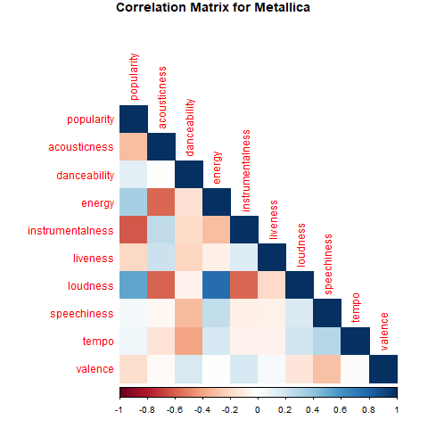
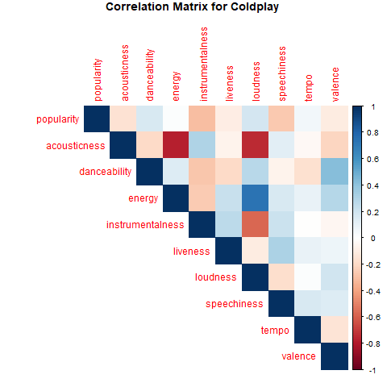

```{r setup, include=FALSE}
knitr::opts_chunk$set(echo = FALSE, message = FALSE, warning = FALSE, fig.width = 6, fig.height = 5, fig.pos="H", fig.pos = 'H')
if(!require("tidyverse")) install.packages("tidyverse")
library(tidyverse)
library(viridis)
library(RColorBrewer)
library(corrplot)

```


```{r}
coldplayDF <- read.csv('data/Coldplay_vs_Metallica/Coldplay.csv')
metallicaDF <- read.csv('data/Coldplay_vs_Metallica/metallica.csv')
source('code/merged_songs_plot.R')
source('code/plotPolar.R')
merged<- mergeBands(coldplayDF, metallicaDF)
source("code/corrPlots.R")

```

# Song Releases

The graph below shows song releases by both bands over time. Live performances have been excluded from this analysis.

```{r}
songreleases_plot(merged)
```

Metallica has been active for a much longer than Coldplay as is apparent from the graph above. One striking difference is that Metallica has produced a much greater amount of songs that Coldplay. Even in the period where they were both active, Metallica still produced more songs.

# Song Characteristics

The graphs below break down the average song characteristics of both bands in 5 year periods. The values were scaled using min-max scaling in order to be represented on one graph.
```{r fig.width=7, fig.height=8}
plotPolar(merged)
```

When analysing the graph above it is important to not compare different song characteristics with each other. The only valid comparisons are those between bands within the same characteristic. Nevertheless, this gives plenty to interpret. These figure show that Metallica songs consistently score higher on loudness than Coldplay. Additionally, Coldplay songs score higher on energy than Metallica songs. Interestingly, from 1998-2003, Metallica songs were higher tempo than Coldplay. However in the following years Metallica cut back on high tempo songs until 2018, when their songs once again became more high tempo than that of Coldplay.

# Popularity and Song Characteristic

```{r metallica-plot, out.width='50%', echo=FALSE}


```

By looking at the correlation matrices we can try and infer what makes a Metallica song popular vs what makes a Coldplay song popular.

Metallica songs' popularity is negatively correlated with instrumentalness, indicating that audience prefer a less instrumental Metallica. Popularity is mostly correlated with loudness and energy. This means audiences listen to Metallica more when songs are loud and have high energy.

Coldplay have no strong correlation with any song characteristic. There are some weak positive correlation with danceability and loudness, and weak negative correlation with instrumentalness and speechiness. 
