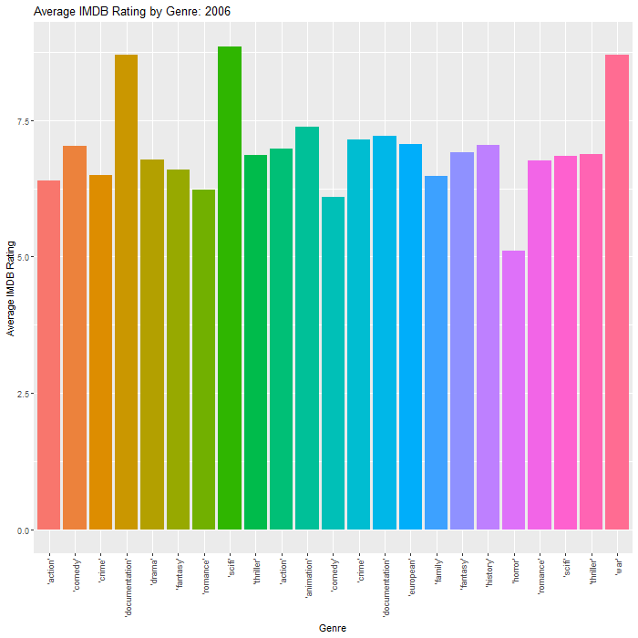

```{r setup, include=FALSE}
knitr::opts_chunk$set(echo = FALSE, message = FALSE, warning = FALSE, fig.width = 6, fig.height = 5, fig.pos="H", fig.pos = 'H')
if(!require("tidyverse")) install.packages("tidyverse")
library(tidyverse)
library(gganimate)
library(gifski)
library(xtable)

```

```{r}
TitlesDF <- read.csv('data/netflix/titles.csv')
source('code/makeGenreGif.R')
source('code/plotPopularity.R')
source('code/plotRunPop.R')
source('code/tableRatings.R')
```

## Genre's and Ratings

The GIF below shows popular genres for Movies and TV shows and the corresponding IMDB score by year.
```{r}
gif <- makeGenreGif(TitlesDF)
gif_anim <- animate(gif, fps=10, duration=20, renderer = gifski_renderer(), height = 700, width = 700)
anim_save("RatingByGenre.gif", gif_anim)
```



Better movies and shows drive viewership. However, these ratings are not dependent on genre. As can be seen from the GIF above, average IMDB scores by category changes drastically from year to year. No one category remains dominant or worse off for extended periods of time. What we can draw from this is that the focus should not be on producing shows of solely a particular genre, since a certain genre does not guarantee better ratings.

## TV Shows vs Movies

The plot below shows the average popularity of TV Shows and Movies across different release dates.
```{r}
plotPopularity(TitlesDF)
```

What is clear from the graph above is that for almost all media produced after the early 1980's, TV Shows have consistently outperformed Movies. Thus if Netflix is looking to expand its collection, this data shows that they should look to TV Shows first.

When deciding what shows to add we can again turn to the data to answer. 

```{r}
plotRunPop(TitlesDF)
```

Since we have established that simply looking at genre is not sufficient, another metric is needed. The graph above shows how popular TV shows and Movies are when compared with their runtime. For TV shows we see it is optimal for an episode to be either around 25 minutes or just below 50 minutes. Movies are most popular just under the 2 hour mark. Any longer, for either type drastically reduced popularity.


## Age Certification and popularity 

```{r, results='asis'}
ratingsTable <- options(xtable.comment = FALSE)
ratingsTable <- tableRatings(TitlesDF)
ratingsTable
```

By looking at the Age Rating of content on Netflix and their corresponding popularity, we can gain insights into what type of content the users are looking for. From the table above we see that TV-G shows are the most popular demographic, while TV-Y is the least popular. This could indicate that Netflix should invest more in general inoffensive content than content catered to children and toddlers. 

-Ruan Geldenhuys
