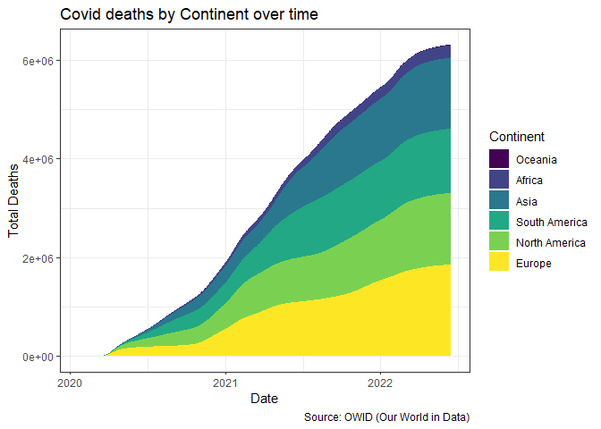
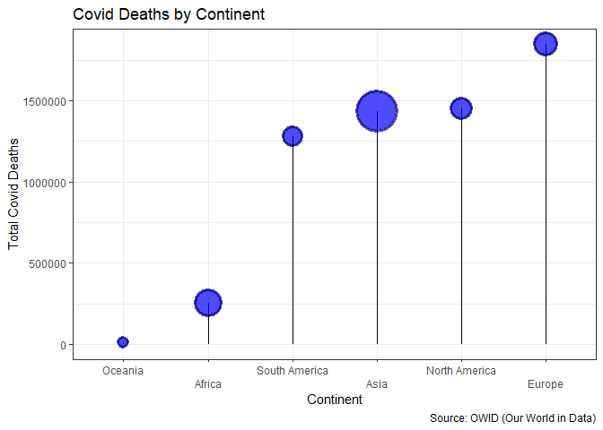
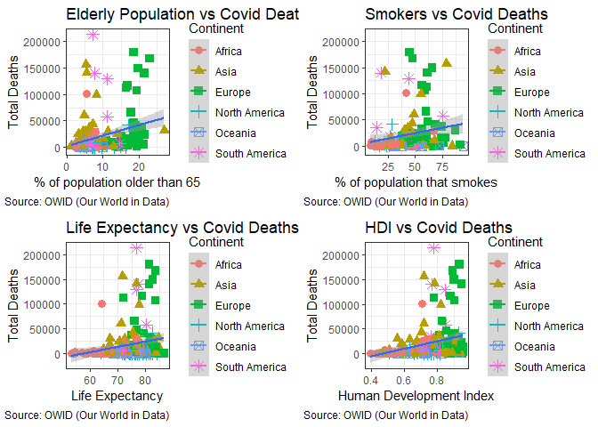
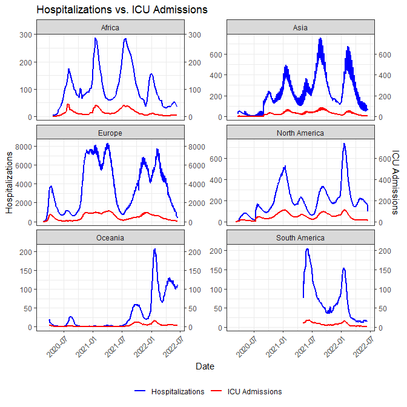

# Data Science 871 Exam - Ruan Geldenhuys

## Purpose

The purpose of this repository is to host my Data Science practical
exam, taken on 16/06/2023. This README contains only output and
interpretation. Full code can be found under the code folder under the
respective question’s folder.

## Question 1 - Covid-19

### Covid deaths by Continent

``` r
plotCovidArea(CovidDF)
```

<!-- -->

The graph above breaks down Covid-19 deaths over time by continent.
Europe had the most deaths and Oceania the least (as can be seen from
the fact that they are barely visible on the graph). Africa had the
second lowest amount of deaths.

``` r
plotCovidLollipop(CovidDF)
```

<!-- -->

The lollipop chart above once again shows the total deaths broken down
by continent. The size of each point is representative of the continent
population size. We see that population size is not indicative of Covid
deaths. Africa has a larger population size than South and North
America, yet has far fewer Covid deaths.

### Demographic factors and Covid

``` r
demographyPlot(CovidDF, 2, 2)
```

<!-- -->

The plots above show the relationship between various demographic
factors and total Covid deaths. Elderly population and Smokers both have
a positive relationship with Covid deaths as expected. What is
surprising is that life expectancy is also positively correlated with
Covid deaths. One potential explanation here could be that higher life
expectancy is poisitve correlated with having more elderly people in the
population and therefore these countries experiences more deaths.
Lastly, the HDI relationship seems erroneous. What is likely happening
here is that Europe’s high death toll is biasing results.

### Hospitilastion and ICU

``` r
plotICUvHOSP(CovidDF)
```

<!-- -->

The graph shows that for all continents, shortly after hospitalization
started to increase, so would ICU patients. This effect is likely due to
individuals first being hospitalized and shortly after their situation
would deteriorate and they would be transferred to ICU.


