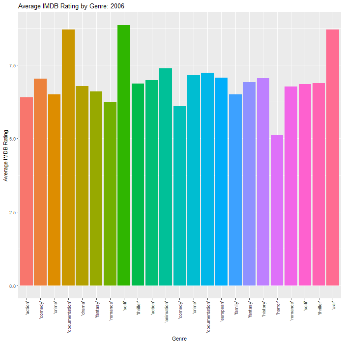

# Purpose

Purpose of this work folder.

Ideally store a minimum working example data set in data folder.

Add binary files in bin, and closed R functions in code. Human Readable
settings files (e.g. csv) should be placed in settings/

``` r
rm(list = ls()) # Clean your environment:
gc() # garbage collection - It can be useful to call gc after a large object has been removed, as this may prompt R to return memory to the operating system.
```

    ##          used (Mb) gc trigger (Mb) max used (Mb)
    ## Ncells 454964 24.3     977775 52.3   644242 34.5
    ## Vcells 812372  6.2    8388608 64.0  1635706 12.5

``` r
library(tidyverse)
```

    ## Warning: package 'tidyverse' was built under R version 4.2.3

    ## Warning: package 'ggplot2' was built under R version 4.2.3

    ## Warning: package 'tibble' was built under R version 4.2.3

    ## ── Attaching core tidyverse packages ──────────────────────── tidyverse 2.0.0 ──
    ## ✔ dplyr     1.1.0     ✔ readr     2.1.4
    ## ✔ forcats   1.0.0     ✔ stringr   1.5.0
    ## ✔ ggplot2   3.4.2     ✔ tibble    3.2.1
    ## ✔ lubridate 1.9.2     ✔ tidyr     1.3.0
    ## ✔ purrr     1.0.1     
    ## ── Conflicts ────────────────────────────────────────── tidyverse_conflicts() ──
    ## ✖ dplyr::filter() masks stats::filter()
    ## ✖ dplyr::lag()    masks stats::lag()
    ## ℹ Use the ]8;;http://conflicted.r-lib.org/conflicted package]8;; to force all conflicts to become errors

``` r
library(Texevier)
list.files('code/', full.names = T, recursive = T) %>% .[grepl('.R', .)] %>% as.list() %>% walk(~source(.))
```

# `{r} # Texevier::create_template("C:/Users/ruanm/OneDrive/Desktop/Masters/Data Science/22550801", template_name = 'Question1') # Texevier::create_template("C:/Users/ruanm/OneDrive/Desktop/Masters/Data Science/22550801", template_name = 'Question2') # Texevier::create_template("C:/Users/ruanm/OneDrive/Desktop/Masters/Data Science/22550801", template_name = 'Question3') # Texevier::create_template("C:/Users/ruanm/OneDrive/Desktop/Masters/Data Science/22550801", template_name = 'Question4') # Texevier::create_template("C:/Users/ruanm/OneDrive/Desktop/Masters/Data Science/22550801", template_name = 'Question5') #`


