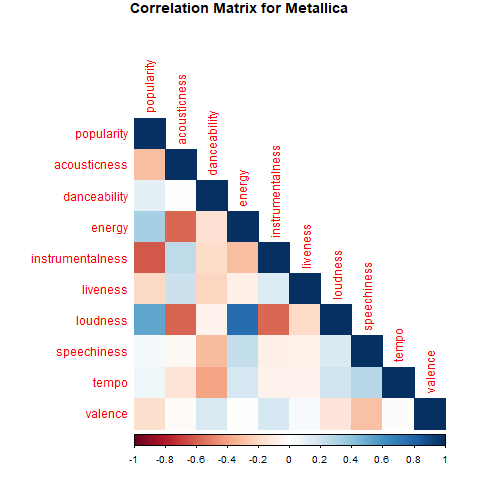
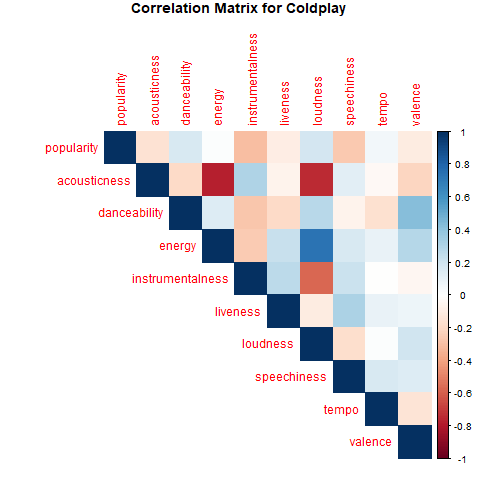
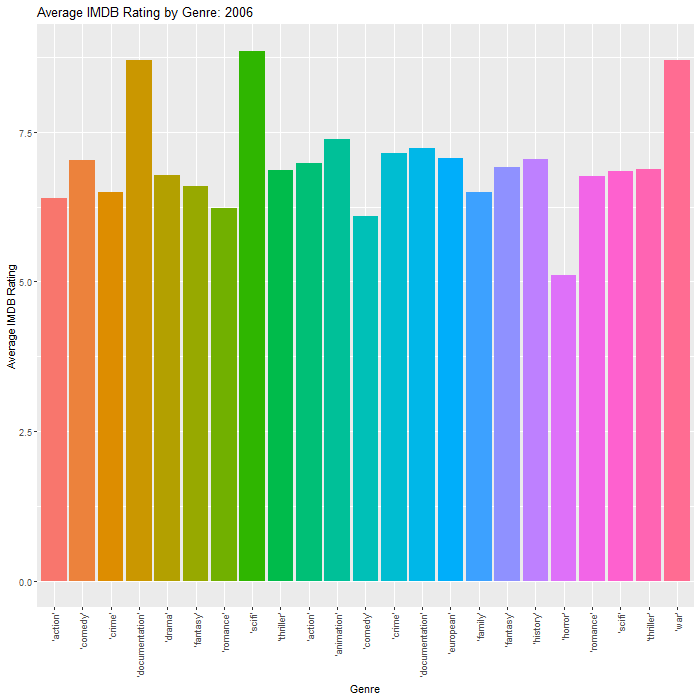

# Data Science 871 Exam - Ruan Geldenhuys

## Purpose

The purpose of this repository is to host my Data Science practical exam, taken on 16/06/2023. This README contains only output and interpretation. Full code can be found under the code folder under the respective question's folder.


```{r include=FALSE}
rm(list = ls()) 
gc()
library(tidyverse)
library(Texevier)
library(ggpubr)
library(hrbrthemes)
library(viridis)
library(xtable)
library(RColorBrewer)
library(corrplot)
library(gganimate)
library(gifski)
#list.files('code/', full.names = T, recursive = T) %>% .[grepl('.R', .)] %>% as.list() %>% walk(~source(.))
```

## Question 1 - Covid-19

This document aims to use global Covid data in order to investigate patterns in Covid-19 statistics. The data was provided by Our World in Data (OWID). Primarily, this analysis will focus on continent level differences in Covid-19 trends.

```{r include=FALSE}
DeathCauseDF <- read.csv('data/Covid/Deaths_by_cause.csv')
CovidDF <- read.csv('data/Covid/owid-covid-data.csv')
source('Question1/code/CovidDeathfunctions.R')
source('Question1/code/demographyPlot.R')
source('Question1/code/plotICUvHOSP.R')
```

### Covid deaths by Continent

```{r warning=FALSE}
plotCovidArea(CovidDF)
```

The graph above breaks down Covid-19 deaths over time by continent. Europe had the most deaths and Oceania the least (as can be seen from the fact that they are barely visible on the graph). Africa had the second lowest amount of deaths.

```{r}
plotCovidLollipop(CovidDF)
```

The lollipop chart above once again shows the total deaths broken down by continent. The size of each point is representative of the continent population size. We see that population size is not indicative of Covid deaths. Africa has a larger population size than South and North America, yet has far fewer Covid deaths.

### Demographic factors and Covid

```{r fig.width=7}
demographyPlot(CovidDF, 2, 2)
```

The plots above show the relationship between various demographic factors and total Covid deaths. Elderly population and Smokers both have a positive relationship with Covid deaths as expected. What is surprising is that life expectancy is also positively correlated with Covid deaths. One potential explanation here could be that higher life expectancy is poisitve correlated with having more elderly people in the population and therefore these countries experiences more deaths. Lastly, the HDI relationship seems erroneous. What is likely happening here is that Europe's high death toll is biasing results.

### Hospitilastion and ICU

```{r fig.width=7, fig.height=7}
plotICUvHOSP(CovidDF)
```

The graph shows that for all continents, shortly after hospitalization started to increase, so would ICU patients. This effect is likely due to individuals first being hospitalized and shortly after their situation would deteriorate and they would be transferred to ICU.


## Question 2 - London Weather - How bad is it really?

In order to convince my friend not to move to the UK, I did some data analysis on London's weather patterns. Since she is not a big reader, I will keep my discussion to a minimum.

```{r include=FALSE}
londonWeather <- read.csv('data/London/london_weather.csv')
UKmonthlyDF <- read.csv('data/London/UKMonthly_Detailed.csv')
londonDF <- londonWeather %>%
    mutate(date = ymd(date)) %>%
    mutate(date = format(date, "%Y/%m/%d")) %>%
    mutate(month = month(date, label = TRUE))
source('Question2/code/PlotTempPrecip.R')
source('Question2/code/coveragePlot.R')
source('Question2/code/rainyDays.R')
source('Question2/code/rainComparePlot.R')
```

### Temperature and Precipation

The graph below shows a breakdown of temperature and rain in London throughout the year.

```{r  fig.width=7, fig.height=5}
plotTempPrecip(londonDF)
```

It's clear that London is a very cold and wet place with the maximum average temperature being 23.7 and having dearly 2 inches (50mm) of rain all year round.

### Sunshine, or rather the lack thereof

The plot below shows the average cloud coverage in London by month.

```{r}
coveragePlot(londonDF, "Monthly Cloud Coverage - London")
```

Sunny days are few in London, as most days are partly cloudy or overcast, as can be seen in the graph above.

### London vs Cape Town

Using data from the Southern Africa Tourism Services Association we can compare London and Cape Town.

```{r, results='asis'}
rainTable <- rainyTable(londonDF, Latex = FALSE)
rainTable
```
```{r}
rainComparePlot(londonDF)
```

It is clear from the table and the graph that London experiences vastly more rain than Cape Town. London in its driest month gets more rain than Cape Town in its wettest month.

## Question 3 - Metallica vs Coldplay - A closer look

This document aims to investigate the careers of Metallica and Coldplay. By comparing these band I hope to gain insight into key differences in history, style and popularity these bands experienced. This analysis will be done using data obtained from Spotify.

```{r include=FALSE}
coldplayDF <- read.csv('data/Coldplay_vs_Metallica/Coldplay.csv')
metallicaDF <- read.csv('data/Coldplay_vs_Metallica/metallica.csv')
source('Question3/code/merged_songs_plot.R')
source('Question3/code/plotPolar.R')
merged<- mergeBands(coldplayDF, metallicaDF)
source("Question3/code/corrPlots.R")
```

### Song Releases

The graph below shows song releases by both bands over time. Live performances have been excluded from this analysis.

```{r}
songreleases_plot(merged)
```

Metallica has been active for a much longer than Coldplay as is apparent from the graph above. One striking difference is that Metallica has produced a much greater amount of songs that Coldplay. Even in the period where they were both active, Metallica still produced more songs.

### Song Characteristics

The graphs below break down the average song characteristics of both bands in 5 year periods. The values were scaled using min-max scaling in order to be represented on one graph.
```{r fig.width=7, fig.height=8, warning=FALSE}
plotPolar(merged)
```

When analysing the graph above it is important to not compare different song characteristics with each other. The only valid comparisons are those between bands within the same characteristic. Nevertheless, this gives plenty to interpret. These figure show that Metallica songs consistently score higher on loudness than Coldplay. Additionally, Coldplay songs score higher on energy than Metallica songs. Interestingly, from 1998-2003, Metallica songs were higher tempo than Coldplay. However in the following years Metallica cut back on high tempo songs until 2018, when their songs once again became more high tempo than that of Coldplay.

### Popularity and Song Characteristic

```{r metallica-plot, out.width='50%', echo=FALSE}


```

By looking at the correlation matrices we can try and infer what makes a Metallica song popular vs what makes a Coldplay song popular.

Metallica songs' popularity is negatively correlated with instrumentalness, indicating that audience prefer a less instrumental Metallica. Popularity is mostly correlated with loudness and energy. This means audiences listen to Metallica more when songs are loud and have high energy.

Coldplay have no strong correlation with any song characteristic. There are some weak positive correlation with danceability and loudness, and weak negative correlation with instrumentalness and speechiness. 

## Question 4 - How to save Netflix: A Data-driven approach

This document investigates Movie and TV Show data provided by Netflix in order to visualise what factors lead to content on Netflix being popular and highly rated. This information can then be used as a jumping off point to improve the content delivery Netflix provides and alleviate some of the rough times the company is facing.
[Note: Keep this document as .html, TeX does not play well with GIF's]

```{r include=FALSE}
TitlesDF <- read.csv('data/netflix/titles.csv')
source('Question4/code/makeGenreGif.R')
source('Question4/code/plotPopularity.R')
source('Question4/code/plotRunPop.R')
source('Question4/code/tableRatings.R')
```

### Genre's and Ratings

The GIF below shows popular genres for Movies and TV shows and the corresponding IMDB score by year.
```{r}
gif <- makeGenreGif(TitlesDF)

#Uncomment and run these 2 lines if you want to rerender the animation
#gif_anim <- animate(gif, fps=10, duration=20, renderer = gifski_renderer(), height = 700, width = 700)
#anim_save("RatingByGenre.gif", gif_anim)
```



Better movies and shows drive viewership. However, these ratings are not dependent on genre. As can be seen from the GIF above, average IMDB scores by category changes drastically from year to year. No one category remains dominant or worse off for extended periods of time. What we can draw from this is that the focus should not be on producing shows of solely a particular genre, since a certain genre does not guarantee better ratings.

### TV Shows vs Movies

The plot below shows the average popularity of TV Shows and Movies across different release dates.

```{r}
plotPopularity(TitlesDF)
```

What is clear from the graph above is that for almost all media produced after the early 1980's, TV Shows have consistently outperformed Movies. Thus if Netflix is looking to expand its collection, this data shows that they should look to TV Shows first.

When deciding what shows to add we can again turn to the data to answer. 

```{r}
plotRunPop(TitlesDF)
```

Since we have established that simply looking at genre is not sufficient, another metric is needed. The graph above shows how popular TV shows and Movies are when compared with their runtime. For TV shows we see it is optimal for an episode to be either around 25 minutes or just below 50 minutes. Movies are most popular just under the 2 hour mark. Any longer, for either type drastically reduced popularity.


### Age Certification and popularity 

```{r, results='asis'}
ratingsTable <- tableRatings(TitlesDF, Latex = FALSE)
ratingsTable
```


By looking at the Age Rating of content on Netflix and their corresponding popularity, we can gain insights into what type of content the users are looking for. From the table above we see that TV-G shows are the most popular demographic, while TV-Y is the least popular. This could indicate that Netflix should invest more in general inoffensive content than content catered to children and toddlers. 

## Question 5 - App data from Google Play Store

This document investigates what makes applications on the Google Play Store successful by using publicaly available data regarding app information. By comparing app level characteristics, it is possible to gain insight into why some apps outperform others.

```{r include=FALSE}
appsDF <- read.csv('data/googleplay/googleplaystore.csv')
reviewsDF <- read.csv('data/googleplay/googleplaystore.csv')
source('Question5/code/downloadsTable.R')
source('Question5/code/DownloadsSizesPlot.R')
```

### Price Range and Downloads

Below is a table that displays different price ranges for apps, together with the median and average downloads for that price range. The table is sorted by average downloads.

```{r, results='asis'}
options(scipen = 999)
outputtable <- downloadsTable(appsDF, Latex = FALSE)
outputtable
```

It is clear from the table that cheaper apps garner more downloads. While this correlation is not perfect it does roughly hold across the different price ranges. This effect is to expected in any product, not just apps. When building an app it is important to consider the trade-off between the upfront revenue versus ad-revenue. This data shows that it is a possibility that ad-revenue could outperform upfront revenue since the difference in downloads between price ranges is so large.

Note however, these average could be blown out of proportion due to hyper-successful outliers. The counter argument to that however, is the fact that for every successful app, there is likely to be an app that gets almost no downloads.

### Categories of Apps

The graph below shows the top ten categories of apps on the Google Play Store. The bars indicate average downloads, while the line represents the average size of the apps in the category.
```{r fig.width=8, fig.height=6}
DownloadsSizesPlot(appsDF)
```

Gaming apps are by far the most popular app on the Google Play Store, followed by Entertainment and Communication. When comparing the relative popularity of apps to their sizes, one might be tempted to infer that larger apps perform better. However, this relationship only holds for the top three categories, and is therefore likely not causal. Most apps, apart from gaming, fall around the 20 MB range. Thus, when developing an app we should aim for this size, as much larger might deter users since modern phones don't accommodate external storage.

Furthermore, one should be wary of simply building a mobile app because gaming is the most popular category, since this market is likely to be saturated. Instead more market research is needed before committing to a single category of app.

